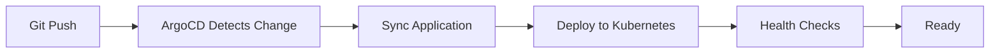

# Isola Platform - GitOps with ArgoCD & Helm

## 🎯 What's New

Your Isola platform is now GitOps-ready with a clean, scalable structure for ArgoCD and Helm integration.

## 📁 New Folder Structure

```
dev-isola/
├── charts/                    # Helm charts (NEW)
│   ├── isola-controller/      # Controller service chart
│   ├── isola-agent/           # Agent service chart (to be created)
│   └── isola-platform/        # Umbrella chart for entire platform
│
├── argocd/                    # ArgoCD configurations (NEW)
│   ├── bootstrap/             # ArgoCD installation scripts
│   ├── app-of-apps/           # Environment-specific app collections
│   ├── applications/          # Individual app manifests
│   └── projects/              # ArgoCD project definitions
│
├── environments/              # Environment configs (NEW)
│   ├── dev/
│   ├── staging/
│   └── production/
│
├── docs/
│   └── gitops-setup.md        # Complete GitOps guide (NEW)
│
└── scripts/
    └── migrate-to-helm.sh     # Migration helper script (NEW)
```

## 🚀 Quick Start

### 1. Migrate from Raw Manifests to Helm

```bash
# Run migration script to validate setup
./scripts/migrate-to-helm.sh
```

### 2. Install ArgoCD

```bash
cd argocd/bootstrap
./install-argocd.sh --dev
```

### 3. Bootstrap the Platform

```bash
# Automated bootstrap
./bootstrap.sh

# Access ArgoCD UI
kubectl port-forward svc/argocd-server -n argocd 8080:443
# Navigate to https://localhost:8080
```

## 📋 Key Features

### ✅ Helm Charts
- **Templated Deployments**: Reusable charts for all services
- **Environment-Specific Values**: `values-dev.yaml`, `values-staging.yaml`, `values-prod.yaml`
- **Umbrella Chart**: Single chart to deploy entire platform
- **Dependency Management**: Sub-charts for modular deployment

### ✅ ArgoCD Integration
- **App of Apps Pattern**: Manage multiple applications as a group
- **Auto-Sync**: Automatic deployment on Git commits (configurable)
- **Progressive Delivery**: Deploy dev → staging → production
- **RBAC**: Project-based access control

### ✅ Clean Separation
- **Charts**: Application definitions
- **ArgoCD**: Deployment orchestration
- **Environments**: Configuration per environment
- **GitOps**: Everything from Git, nothing manual

## 🔄 Deployment Workflow



## 📝 Common Tasks

### Deploy to Development
```bash
# Automatic (if auto-sync enabled)
git push origin main

# Manual
argocd app sync isola-platform-dev
```

### Update Configuration
```bash
# Edit values
vim charts/isola-controller/values-dev.yaml

# Commit and push
git add . && git commit -m "Update config" && git push
```

### Add New Service
1. Create Helm chart in `charts/new-service/`
2. Add to platform dependencies
3. Create ArgoCD application manifest
4. Deploy via Git push

## 🔐 Security Notes

- **Secrets**: Use Sealed Secrets or External Secrets Operator (not plain text)
- **RBAC**: Configured in Helm values
- **Network Policies**: Can be enabled in values
- **Image Security**: Scan images before deployment

## 📊 Benefits

1. **GitOps Native**: All changes tracked in Git
2. **Scalable**: Easy to add environments or services
3. **Rollback**: Simple rollback via Git or ArgoCD
4. **Observability**: ArgoCD provides deployment insights
5. **Consistency**: Same charts across all environments
6. **Self-Documenting**: Infrastructure as code

## 🛠️ Customization

### For Your Repository
1. Update repository URLs in ArgoCD manifests
2. Modify image repositories in Helm values
3. Adjust resource limits per environment
4. Configure your domain names

### Environment-Specific Settings
- Development: Auto-sync, debug logging, minimal resources
- Staging: Manual sync, info logging, moderate resources
- Production: Manual sync, error logging, full resources

## 📚 Documentation

- [Complete GitOps Setup Guide](docs/gitops-setup.md)
- [Helm Chart Structure](charts/isola-controller/README.md)
- [ArgoCD Best Practices](argocd/README.md)

## 🚦 Next Steps

1. **Review and customize** the Helm values for your needs
2. **Update image repositories** to match your registry
3. **Set up CI/CD** to build and push images
4. **Configure secrets management** (Sealed Secrets/SOPS)
5. **Deploy to your cluster** using the bootstrap script

## ⚡ Tips

- Use `helm template` to preview generated manifests
- Enable ArgoCD notifications for Slack/email alerts
- Set up ArgoCD Image Updater for automated image updates
- Use Kustomize overlays for complex customizations
- Monitor with Prometheus/Grafana integration

## 🤝 Need Help?

Check the comprehensive [GitOps Setup Guide](docs/gitops-setup.md) for detailed instructions, troubleshooting, and best practices.

---

**Ready to go GitOps!** Your infrastructure is now declarative, version-controlled, and automated. 🎉
