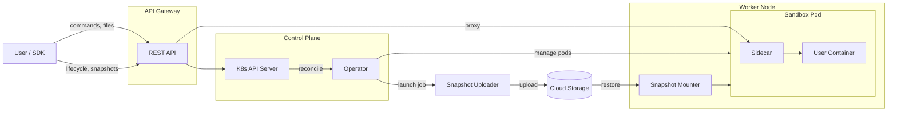

<p align="center">
  
</p>

<p align="center">
  <strong>Secure sandboxing for Kubernetes</strong>
</p>

<p align="center">
  <a href="https://github.com/isola-run/isola/blob/main/LICENSE"></a>
  <a href="https://github.com/isola-run/isola/actions"></a>
  <a href="https://goreportcard.com/report/github.com/isola-run/isola"></a>
</p>

---

Isola is an open-source platform for running untrusted and AI-generated code securely on your own Kubernetes cluster. It uses [gVisor](https://gvisor.dev) to isolate each sandbox behind its own application kernel, without requiring bare-metal machines or nested virtualization.

Create sandboxes from any OCI container image, execute commands with streaming output, read and write files, and snapshot the root filesystem for restore in new sandboxes. Isola provides a REST API and language SDKs so you can integrate sandboxing into your application in a few lines of code.

Isola is self-hosted. You run it on your own infrastructure, you control where data goes, and you operate it with the Kubernetes tools you already know.

## Quick start

Install the Python SDK (requires Python 3.10+) and point it at your Isola API gateway:

```bash
pip install isola
export ISOLA_URL=http://localhost:8080  # or your API gateway address
```

Create a sandbox, run a command, and read the output:

```python
from isola import Isola

with Isola() as client:
    sandbox = client.sandboxes.create(image="python:3.12-slim")
    result = sandbox.commands.run("python3", "-c", "print('hello from the sandbox')")
    print(result.stdout)    # "hello from the sandbox\n"
    print(result.exit_code) # 0
    sandbox.delete()
```

Stream output from a long-running command:

```python
from isola import Isola

with Isola() as client:
    sandbox = client.sandboxes.create(image="alpine:3.21")
    cmd = sandbox.commands.spawn("sh", "-c", "for i in 1 2 3; do echo step$i; sleep 1; done")
    for chunk in cmd.stdout:
        print(chunk, end="")
    exit_code = cmd.wait()
    sandbox.delete()
```

Snapshot the filesystem and restore it in new sandboxes. Install dependencies once, then reuse that environment every time:

```python
from isola import Isola, Network

with Isola() as client:
    # Install dependencies once, then snapshot
    sandbox = client.sandboxes.create(
        image="python:3.12-slim",
        network=Network(allow_internet_egress=True),
    )
    sandbox.commands.run("pip", "install", "numpy", "pandas", "scikit-learn")
    client.rootfs_snapshots.create(sandbox_id=sandbox.id, snapshot_name="datascience")
    sandbox.delete()

    # Every new sandbox starts with everything pre-installed
    sandbox = client.sandboxes.create(
        image="python:3.12-slim",
        rootfs_snapshot_name="datascience",
    )
    result = sandbox.commands.run("python3", "-c", "import sklearn; print(sklearn.__version__)")
    print(result.stdout)
    sandbox.delete()
```

See the [Python SDK documentation](sdks/python/README.md) for the full API reference.

## Why Isola?

- **Open source.** Apache 2.0 licensed. The code is yours to audit, modify, and deploy.

- **Self-hosted.** Sandboxes run on your Kubernetes nodes. You control your infrastructure and decide where data is stored.

- **Kubernetes-native.** Sandboxes and snapshots are Custom Resources managed by a Kubernetes operator. They integrate naturally with your existing RBAC, monitoring, and tooling.

- **Simple to operate.** One Helm install. No database, no Redis, no message queue. The only dependencies are a Kubernetes cluster with gVisor and an optional object storage bucket for snapshots.

- **gVisor isolation without infrastructure overhead.** [gVisor](https://gvisor.dev) intercepts application system calls in user space, providing a strong security boundary without requiring hardware virtualization. Unlike microVM-based solutions (Firecracker, Cloud Hypervisor), there is no need for bare-metal machines, nested virtualization support, or dedicated VM management infrastructure. Isola runs on any Kubernetes node pool, including spot and preemptible instances.

- **Rootfs snapshot and restore.** Capture a sandbox's filesystem changes and restore them in a new sandbox on any node. Pre-warm environments once, reuse everywhere.

- **Configurable network isolation.** Sandboxes have no network access by default. Enable internet egress, restrict traffic to specific CIDRs, or control DNS resolution, all per sandbox.

- **Developer-first SDKs.** Python SDK with sync and async clients. TypeScript SDK coming soon.

- **Keep your existing stack.** Isola exposes Prometheus metrics and standard Kubernetes logs. It fits into the observability tools you already run.

## What Isola is not

- **Not a hosted service.** There is no SaaS offering. You deploy and operate Isola on your own Kubernetes cluster.
- **Not a VM-based sandbox.** Isola uses gVisor, an application kernel that runs in user space, not virtual machines like Firecracker. This means no KVM requirement and no need for dedicated VM infrastructure.

## Features

### Sandbox lifecycle

Create sandboxes from OCI container images with configurable CPU, memory, and ephemeral storage limits. Set a timeout for automatic cleanup, or delete sandboxes explicitly. Sandboxes support multiple containers in a single pod for advanced use cases.

```python
sandbox = client.sandboxes.create(
    image="python:3.12-slim",
    cpu=0.5,                  # CPU cores
    memory=256,               # MiB
    ephemeral_storage=1024,   # MiB
    timeout_seconds=3600,     # auto-delete after 1 hour
)
```

### Command execution

Run commands and wait for completion, or spawn non-blocking commands and stream stdout/stderr as output arrives. Send input to stdin for interactive processes. Set per-command timeouts.

```python
# Blocking
result = sandbox.commands.run("ls", "-la", cwd="/app", timeout_seconds=30)

# Non-blocking with streaming
cmd = sandbox.commands.spawn("python3", "train.py")
for chunk in cmd.stdout:
    print(chunk, end="")

# Stdin
result = sandbox.commands.run("cat", input="data from stdin\n")
```

### File I/O

Read and write files inside sandboxes. Supports text, binary data, and streaming uploads from local files. Parent directories are created automatically.

```python
sandbox.filesystem.write("/tmp/hello.txt", "Hello, World!")
data = sandbox.filesystem.read("/tmp/hello.txt")
print(data.decode())  # "Hello, World!"
```

### Rootfs snapshots

Capture a container's root filesystem changes to cloud storage (S3, GCS, or Azure Blob Storage) and restore them in new sandboxes on any node. Only the modified overlay layer is captured, not the full image.

A DaemonSet on each node mounts the storage bucket via NFS, so all snapshots are available on every node without manual distribution. On Kubernetes 1.34+, restore is resilient: when a sandbox references a snapshot, it retries until the snapshot appears in the bucket or the startup timeout expires.

Sandboxes can also be configured to snapshot automatically before termination:

```python
from isola import SnapshotRootfs

sandbox = client.sandboxes.create(
    image="alpine:3.21",
    termination_policy=SnapshotRootfs(snapshot_name="on-exit-snapshot"),
)
```

### Network isolation

Sandboxes are isolated by default with a deny-all network policy. Network access is configured per sandbox:

```python
from isola import Network

sandbox = client.sandboxes.create(
    image="alpine:3.21",
    network=Network(
        allow_internet_egress=True,           # outbound internet traffic
        allowed_egress_cidrs=["10.0.0.0/8"],  # fine-grained CIDR allowlist
        allow_cluster_dns=True,               # use the cluster's DNS
        nameservers=["8.8.8.8"],              # custom DNS nameservers
        allow_ipv6_egress=True,               # extend egress to IPv6
    ),
)
```

Private IP ranges and cloud metadata endpoints are blocked automatically when internet egress is enabled.

### Multi-container sandboxes

Run multiple containers in a single sandbox and target specific containers for commands and file operations:

```python
from isola import Container

sandbox = client.sandboxes.create(
    containers=[
        Container(name="app", image="python:3.12-slim", command=["python", "-m", "http.server", "8080"]),
        Container(name="worker", image="alpine:3.21"),
    ],
)
result = sandbox.commands.run("curl", "http://localhost:8080", container="worker")
```

## Architecture



| Component | Role |
|-----------|------|
| **Operator** | Watches Sandbox and RootfsSnapshot custom resources. Reconciles the desired state into pods, network policies, and snapshot jobs. |
| **API Gateway** | Exposes the public REST API. Proxies command and file operations to the sandbox sidecar. Translates lifecycle requests into Kubernetes custom resources. |
| **Sandbox Sidecar** | Runs in every sandbox pod. Handles command execution (spawn, stream, kill) and filesystem operations on behalf of the API gateway. |
| **Snapshot Mounter** | A DaemonSet that runs an NFS server backed by cloud storage (via rclone) on each node. Makes snapshot tars available to gVisor for rootfs restore. |
| **Snapshot Uploader** | A short-lived Job created per snapshot. Reads the gVisor overlay upper layer and uploads it to the configured storage bucket. |
| **Helm chart** | Ties the system together. Installs CRDs, deploys the operator and gateway, configures RBAC and network policies, and optionally sets up the snapshot infrastructure. |

## Deployment

### Prerequisites

- A Kubernetes cluster (vanilla, EKS, AKS, GKE, or similar). Kubernetes 1.34+ if enabling rootfs snapshots support.
- [Helm](https://helm.sh) v3.
- A [gVisor](https://gvisor.dev) RuntimeClass configured in your cluster (see [gVisor setup](#gvisor-setup) below).
- (Optional) An S3, GCS, or Azure Blob Storage bucket for rootfs snapshots.

### Install with Helm

```bash
helm repo add isola https://charts.isola.run
helm install isola isola/isola --namespace isola-system --create-namespace
```

The control plane (operator, API gateway) runs in the install namespace. Sandbox pods run in a separate namespace (`isola-sandboxes` by default). Create it:

```bash
kubectl create namespace isola-sandboxes
```

Or let the chart manage it by setting `sandboxNamespace.create: true` in your Helm values.

### gVisor setup

Isola requires a gVisor [RuntimeClass](https://kubernetes.io/docs/concepts/containers/runtime-class/) named `gvisor` in your cluster. If your cluster does not already have gVisor installed:

1. Install the `runsc` binary and containerd shim on each node. See the [gVisor quickstart](https://gvisor.dev/docs/user_guide/containerd/quick_start/) for instructions.

2. Create the RuntimeClass:

```yaml
apiVersion: node.k8s.io/v1
kind: RuntimeClass
metadata:
  name: gvisor
handler: runsc
```

For local development, `hack/setup.sh` automates gVisor installation in a Kind cluster.

### Rootfs snapshots (optional)

Rootfs snapshots are disabled by default. To enable them, configure a storage bucket in your Helm values:

```yaml
operator:
  sandboxRuntime:
    rootfssnapshot:
      enabled: true
      storage:
        type: s3   # or "gcs" or "azure"
        s3:
          bucket: my-isola-snapshots
          region: us-east-1
```

Rootfs snapshot restore requires Kubernetes 1.34+ (for [ContainerRestartRules](https://kubernetes.io/docs/concepts/workloads/pods/init-containers/#container-restart-rules)) and gVisor `release-20260126.0` or later (for [rootfs tar overlay support](https://github.com/google/gvisor/pull/12415)). On older versions, snapshot restore may not recover from transient errors.

Credentials can be provided via workload identity (recommended), a pre-existing Kubernetes secret, or inline values. See [values.yaml](charts/isola/values.yaml) for all options.

## Documentation

| Resource | Description |
|----------|-------------|
| [Python SDK](sdks/python/README.md) | Full SDK reference: sync/async clients, sandbox options, commands, files, snapshots, error handling |
| [Helm values](charts/isola/values.yaml) | All configuration options for the Isola Helm chart |
| [isola.run](https://isola.run) | Project website |
| [API spec](api/openapi/api-gateway.yaml) | OpenAPI specification for the REST API |

## Getting help

- Open an [issue](https://github.com/isola-run/isola/issues) to report bugs or request features.
- Start a [discussion](https://github.com/isola-run/isola/discussions) for questions and general conversation.

## Contributing

Contributions are welcome. For local development, the quickest path is:

```bash
./hack/setup.sh   # one-time: Kind cluster, local registry, gVisor
tilt up            # start the dev environment
make test          # run unit tests
```

Run `make help` for all available targets.

## Security

To report a security vulnerability, see [SECURITY.md](SECURITY.md).

## License

Apache License 2.0. See [LICENSE](LICENSE) for the full license text.
